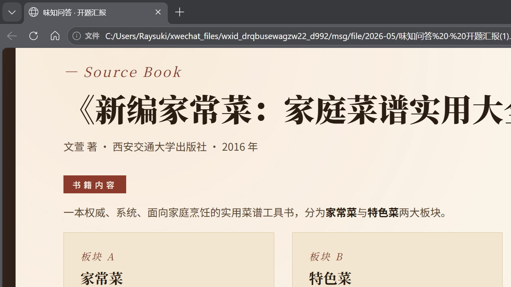

# 品牌养成计划

一款使用 Godot 4.6 制作的 2D 品牌经营养成游戏。玩家扮演美妆品牌主理人，在 24 回合内通过市场调研、产品研发、视觉设计、营销推广、渠道建设、用户运营与危机公关等行动，把一个初创品牌推进到成长期、成熟期，并在最终结算时触发不同结局。

## 当前状态

项目已经具备可运行的 MVP 主循环：

- 开始界面：`res://scenes/StartScreen.tscn`
- 剧情/引导界面：`res://scenes/DialogueScreen.tscn`
- 品牌命名界面：`res://scenes/BrandSetupScreen.tscn`
- 主玩法界面：`res://scenes/Main.tscn`
- 知识面板：广告与营销术语学习内容
- 24 回合经营、阶段推进、风口轮换、事件触发、结局判定

当前主场景已接入背景图、Logo、看板娘、行动分类图标、资源面板、属性面板、右侧行动面板、行动故事卡和结局弹窗等 UI 资源。

## 项目展示




> 如果截图没有刷新，可查看 `docs/screenshots/main_screen.png` 或重新运行项目截取最新界面。

## 核心玩法

游戏以回合制经营为骨架。每回合玩家先规划行动，再点击结束回合统一执行行动并结算收入、开销、风险衰减、事件和阶段变化。

主要资源与指标：

- 资金：行动成本、回合盈亏和破产判定的核心资源
- 行动点：每回合默认 4 点，用于安排行动
- 舆情风险：高风险营销会推高风险，危机公关和用户运营可降低风险
- 品牌知名度：影响声量和收入模型
- 品牌认知度：体现产品力、功效认知和用户理解
- 品牌联想度：体现视觉、风格、审美和文化记忆
- 品牌忠诚度：体现复购、口碑和用户关系
- 渠道掌控力：体现销售渠道、铺货和触达能力

## 阶段设计

游戏分为 3 个经营阶段：

- 初创期：第 1-8 回合，资源紧张，重点是打基础
- 成长期：第 9 回合后，任一核心属性达到 50 且资金达到 80 时进入
- 成熟期：第 17 回合后，任一核心属性达到 75 且资金达到 150 时进入

不同阶段会影响背景表现、经营压力和可持续性判断。

## 行动系统

行动数据位于 `data/actions.json`，目前包含 7 类行动：

- 市场调研：消费者访谈、竞品拆解、风向预判、数据挖掘
- 产品研发：功能迭代、技术攻关、原料升级、产品线扩展
- 视觉设计：LOGO 升级、包装重塑、视觉规范、IP 形象设计
- 营销推广：社媒种草、广告投放、碰瓷营销、KOL 合作、事件营销
- 渠道建设：线上开店、商务谈判、线下铺货、垂直渠道深耕
- 用户运营：社群运营、会员体系、客服优化、用户共创
- 危机公关：诚恳道歉、自查整改、雇佣水军、媒体沟通会

行动会消耗资金和行动点，并对属性、舆情风险、持续开销、标签和后续事件产生影响。重复行动存在收益递减；命中当前风口时会获得额外倍率。

## 风口与事件

`data/trends.json` 定义了每 3 回合轮换一次的风口，例如健康生活、国潮复古、AI 智能、颜值经济、性价比革命、情感消费、圈层文化、可持续环保等。行动标签与当前风口匹配时，会获得 1.3、1.5 或 2.0 倍的效果加成。

`data/events.json` 定义经营事件。事件类型包括：

- 里程碑事件
- 机会事件
- 危机事件

当舆情风险过高或满足特定属性条件时，事件系统会在回合结算后挑选并弹出事件，玩家需要选择处理方案。

## 结局系统

`data/endings.json` 定义最终结局，`scripts/EndingSystem.gd` 负责判定。当前包含破产清算、众矢之的、文艺复兴、昙花一现、时代丰碑、隐形冠军、资本巨兽、国民品牌、艺术图腾、小而美传奇、口碑孤岛、经典老牌、一声叹息、过度扩张、稳步经营等方向。

结局优先级由数据文件控制，强制失败和特殊过程型结局会优先于普通经营结局。

## 运行方式

1. 安装 Godot 4.6 或兼容的 Godot 4.x 版本。
2. 使用 Godot 打开本项目根目录。
3. 直接运行项目，入口场景为 `res://scenes/StartScreen.tscn`。
4. 如需跳过开始流程调试主界面，可在编辑器中单独运行 `res://scenes/Main.tscn`。

## 测试方式

项目包含一个基础烟测场景：

```powershell
godot --headless --path . tests/SmokeTest.tscn
```

烟测会验证数据加载、初始收入/开销、行动执行、自动游玩到第 24 回合、属性范围和结局判定。

## 项目结构

```text
assets/
  backgrounds/      阶段背景与场景图
  icons/            属性、行动、按钮、Logo 等图标
  npcs/             看板娘、部门角色、主理人等 NPC 立绘
  ui/               面板、按钮、行动卡、资源卡等 UI 素材
data/               玩法数值、行动、事件、风口、结局等 JSON 数据
docs/screenshots/   README 展示截图
scenes/             Godot 场景文件
scripts/            核心逻辑与 UI 脚本
tests/              烟测场景与测试脚本
ui/                 旧版或外部导入 UI 参考资源
```

## 主要脚本

- `scripts/DataLoader.gd`：统一加载 `data/` 下的 JSON 数据
- `scripts/GameState.gd`：保存当前回合、资金、属性、风险、标签、行动记录和事件记录
- `scripts/ActionSystem.gd`：执行行动、扣除成本、计算倍率、应用属性和风险变化
- `scripts/TurnManager.gd`：计算收入、开销、风险衰减和回合推进
- `scripts/EventSystem.gd`：筛选事件并应用事件选项效果
- `scripts/EndingSystem.gd`：根据最终状态判定结局
- `scripts/Main.gd`：主玩法 UI、行动计划、风口卡、事件弹窗、故事卡和结局展示
- `scripts/KnowledgeData.gd` / `scripts/KnowledgePanel.gd`：广告营销知识面板

## 已知问题与后续建议

- 当前部分 `.gd`、`.json` 和 `project.godot` 文件中的中文文本显示为乱码，可能是历史编码转换造成的；README 已先恢复为可读中文，后续建议集中修复脚本、数据和配置文件的中文内容。
- `StartScreen.gd` 中“读取存档”按钮目前为空实现，后续可接入存档系统。
- 品牌命名流程已经有界面和脚本，但主玩法中的品牌名还未完整贯穿到 UI 与结局文本。
- 部分数据注释来自 `详细玩法设计2.0.docx`，后续可把设计文档中的未编码内容继续补进事件、行动故事和结局描述。
- 项目已有 `.import` 文件和 Godot 缓存，提交前建议确认哪些资源是正式素材，哪些只是临时参考。

